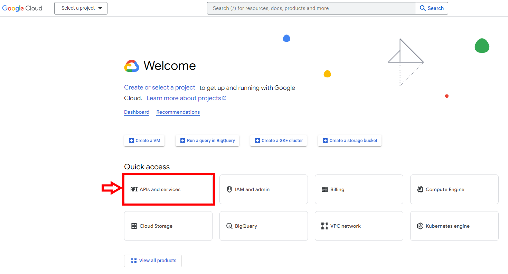
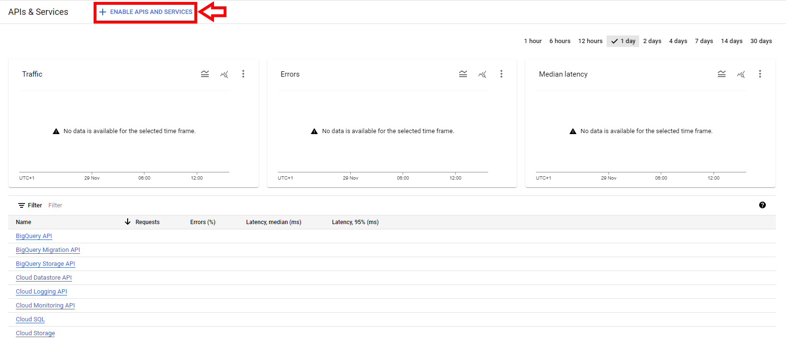
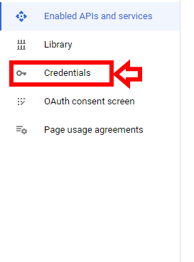
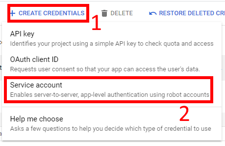
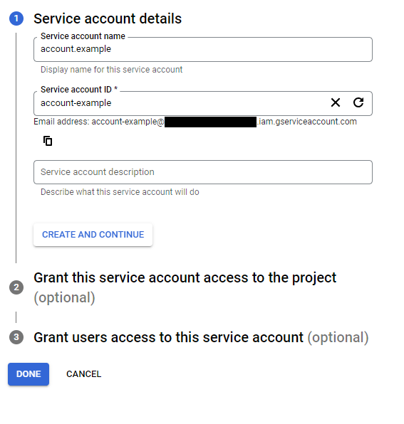
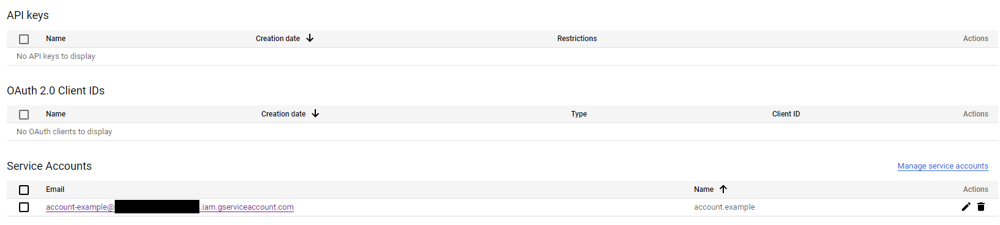
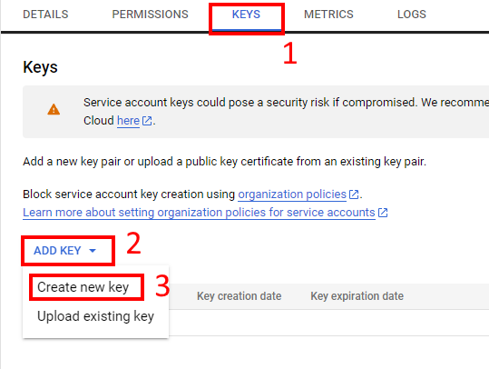
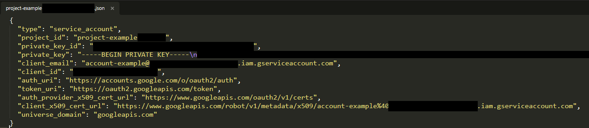

## get google API credentials

If you want to use google api files (google_drive_api.py), you will need credentials for google API.  
It's free, but there are some limitations that you can upgrade by paying.  
For google drive, the limitations are not constraining at all.

### How to get the credentials

You need a google account and to go here: https://console.cloud.google.com/.

You will be on a page like this one, maybe not in english but everything should be identical.  
Go in **APIs and services**. 

Then in **ENABLE APIS AND SERVICES**, you need to create a project, just a project name is asked. Project here is not really your project you are working on, but just a global thing where you can manage each of your services account, and see api's call, etc.  
Then, you will have access to **ENABLE APIS AND SERVICES** now.
You need to enable what you will use, so probably google drive, and google sheet also maybe.

On the left on the same page that on the screenshot before, you will have **Credentials**, go there.

Click on **CREATE CREDENTIALS** and after that **Service account**. As you there are others options you can use if you want for your others project.

Choose a name for your service account, the ID and the mail will be generated with this name. 
In the *Grant this service account access to the project*, you probably want to give **Editor** or **Owner** accesses. 
Then, no need to fill the third part, you can click on **DONE**

Now, you will see your service account displayed. Click on it.

Go to the **KEYS** section. Then **ADD KEY**, and choose to create a new key, in **JSON** format. 
A json file should have been download on your computer.

The json file look like this you open it. You don't need to care about the values. Now, we can use it. 

A service account works like a normal account. So if want your service account to have access to a google drive, share this drive with the mail of the service account.

When you have shared something with the service account, the easyest way to reference it is by ID. The ID is the long string of characters with no logic in the URL.

To use the credentials with the python API file of the ToolBox_GamePatch, first keep the json file somewhere to make infinite copy everytime you want a new version. Then make a copy for the project.

You have 3 choice : 

- you can rename it "credentials.json" and put it at the root of your project, where you run your code.

- You can choose whatever name you want and/or whatever path you want. Python google API files will have a function *set_credentials_path()* to specify the new path. You can set only a folder path if you keep the name "credentials.json", or the path of the file directly if change the name.

- If you want to generate an exe, and you want to share your program with your credentials. You can rename the json as "credentials.py", and before the {} in the credentials, write **credentials_info =**. The file need

Now you can refer to the documention of python file you want to use for further explanation.